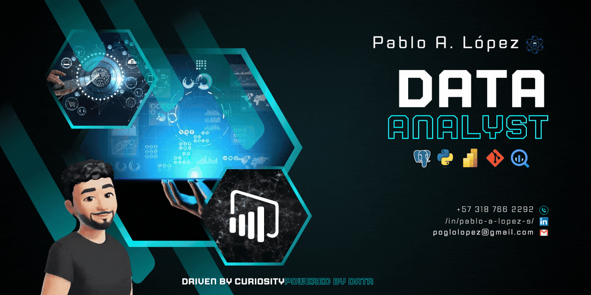

I'm a <strong>Data Analyst</strong> driven by curiosity and a passion for turning raw data into actionable insights.
  With experience in <strong>Power BI, SQL, and Python</strong>, I thrive on solving real-world problems through data-driven decision-making.

## 🚀 About Me
- 📊 Skilled in **Data Visualization, SQL, and Power BI**
- 🏗️ Focused on **data cleaning, transformation, and analysis**
- 🤖 Exploring **Python for data analytics and automation**
- 🔍 Detail-oriented with a **problem-solving mindset**

## 💻 Tech Stack:
   

## 📫 Let’s Connect!  
  

💡 *Always open to learning, collaborating, and tackling new data challenges!*
